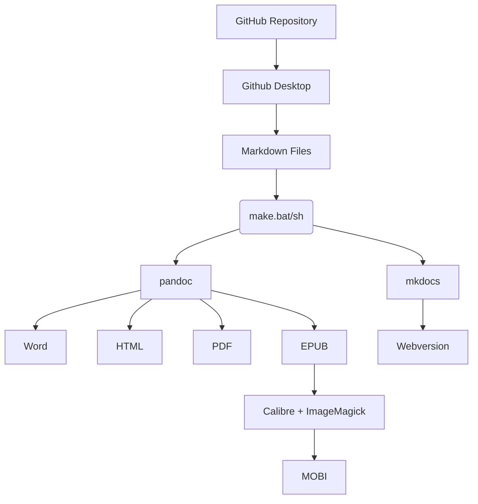

## Leitfaden Produktionskette

lernOS Leitfäden werden in der Auszeichnungssprache [Markdown](https://de.wikipedia.org/wiki/Markdown) erstellt und i.d.R. auf [GitHub](https://de.wikipedia.org/wiki/GitHub) verwaltet. Aus den Markdown-Quellen werden über die lernOS Produktionskette weitere Zielformate wie PDF, Word, E-Book etc. generiert. Diese Generierung kann zentral auf GitHub (noch nicht verfügbar) oder auf dem eigenen Rechner erfolgen. Generiert man die Zieformate auf dem eigenen Rechner, ist ein Toolset notwendig, das im folgenden beschrieben wird. Wir versuchen wo möglich [Open Source Software](https://de.wikipedia.org/wiki/Open_Source) zu verwenden.



### lernOS Leitfaden Verzeichnisstruktur

Damit die lernOS Produktionskette funktioniert, müssen die Inhalte des Leitfadens in einem Dateiordner mit folgender Verzeichnisstruktur abgelegt werden (Beispiel für ein Leitfaden mit deutscher und englischer Version, fett sind Ordner- und Dateinamen, dahinter eine kurze Beschreibung):

```
lernos-repository
|– de                                # Deutsche Sprachversion
   |– src                            # Markdown Quelldateien
      |– css
         |– extra.css                # CSS-Datei für Webversion
      |– images                      # Leitfaden Bilder
      |– 1-0-Grundlagen.md
      |– 2-0-Lernpfad.md
      |– 3-0-Anhang.md
      |– index.md                    # Willkommens-Kapitel (=Startseite)
   |– lernos-repository-de.docx      # Word-Version
   |– lernos-repository-de.epub      # E-Book-Version (epub)
   |– lernos-repository-de.html      # HTML-Version
   |– lernos-repository-de.mobi      # E-Book-Version (mobi)
   |– lernos-repository-de.pdf       # PDF-Version
   |– make.bat                       # Make-Datei (Windows)
   |– make.sh                        # Make-Datei (Mac, Linux)
   |– metadata.yaml                  # Metadaten für Pandoc
   |– mkdocs.yml                     # Steuerdaten für Webversion
|– en                                # gleiche Struktur wie de
|– docs                              # Webversionen (nach Sprache)
   |– de
   |– en
|– README.md                         # Wird auf Github angezeigt
```

* **de** - Inhalte der deutschen Version des Leitfadens
  
  * **src** - die Markdown-Quellen des Leitfaden
    
    * **css** - Anpassung von Farben für die Web-Version
    * **images** - Bilder des Leitfadens in den Formaten SVG und PNG
    * **1-Grundlagen.md** - das Kapitel "Grundlagen"
    * **2-Lernpfad.md** - das Kapitel "Lernpfad"
    * **3-Anhang.md** - das Kapitel "Anhang"
    * **index.md** - das Kapitel "Über lernOS", muss wegen Web-Version index.md heißen
  
  * **make.bat** - das Herzstück der Produktionskette, [Batch-Datei](https://de.wikipedia.org/wiki/BAT-Datei) (Windows), die alle Ergebnisdokumente produziert, im Datei-Explorer per Doppelklick ausführen. Hinweis: für Mac und Linux muss stattdessen eine Shell-Datei (make.sh) verwendet werden.
  
  * **metadata.yaml** - Metadaten für Pandoc (z.B. Titel, Untertitel, Autor(en), Version etc.)
  
  * **mkdocs.yaml** - Einstellungen für die Generierung der Web-Version mit mkdocs

* **docs**
  
  * **de** - deutsche Web-Version des Leitfadens
  * **en** - englische Web-Version des Leitfadens

* **en** - Inhalte der deutschen Version des Leitfadens
  
  * Struktur identisch mit der deutschen Sprachversion

**Hinweis:** im Verzeichnis einer Sprachversion liegen zusätzlich alle produzierten Dokumente (z.B. docx, epub, html, mobi, pdf).

**Hinweis:** Für die Benennung der Verzeichnisse für weitere Sprachversionen werden die Kürzel nach [ISO 639-1](https://de.wikipedia.org/wiki/Liste_der_ISO-639-1-Codes) verwendet.

**Hinweis:** Im src-Verzeichnis kann der Leitfaden auch auf Unterkapitelebene in einzelne Markdown-Dateien geteilt werden. Das ist z.B. sinnvoll, wenn mehrere Personen gleichzeitig an den Inhalten arbeiten oder die Inhalte in der Webversion auf Kapitelebene kommentierbar sein sollen.

### lernOS Produktionskette auf Windows 10

Für die Erstellung der Zielformate aus den Markdown-Quellen wird ein sog. [Makefile](https://de.wikipedia.org/wiki/Makefile) verwendet (make.bat). Ist die Produktionskette auf dem eigenen Rechner richtig eingerichtet, führt ein Doppelklick auf dem Makefile (make.bat) dazu, dass alle Zielformate automatisch generiert werden. Je nach Umfang und Geschwindigkeit des eigenen Rechners kann das bis zu einigen Minuten dauern. Folgende Schritte werden in der Produktionskette ausgeführt:

1. Alte Versionen der produzierten Dokumente löschen.
2. Word-Version (.docx) produzieren
3. HTML-Version (.html) produzieren (rohes HTML, z.B. für Copy&Paste in CMS oder ESN)
4. Web-Version produzieren (mkdocs mit Theme [material](https://squidfunk.github.io/mkdocs-material/), Ergebnis im Ordner docs)
5. PDF-Version produzieren (.pdf)
6. Titelseite als Grafik aus PDF exportieren (src/images/ebook-cover.jpg)
7. E-Book-Version EPUB (.epub) produzieren
8. E-Book-Version EPUB (.epub) on Mobipocket (.mobi) konvertieren
9. Fertig :-)

### Ideen für die Erweiterung der lernOS Produktionskette

Wie auch die Leitfäden wird die lernOS Produktionskette kontinuierlich erweitert. Einige Ideen für die Erweiterung:

* **Github Actions:** aktuell ist eine automatisierte Produktionskette mit [GitHub Actions](https://github.com/features/actions) in Vorbereitung.
* **OneNote:** zusätzlich Produktion einer OneNote-Version der Leitfäden (aktuell nur als Begleitdokument, das manuell gepflegt werden muss).
* **Audiobook:** Produktion eines Audiobooks mit Kapitelmarken zum Anhören (z.B. mit [Balbolka](http://www.cross-plus-a.com/balabolka.htm)).

## Toolset für die Produktionskette

Für die lernOS Produktionskette sind einige Tools auf dem eigenen Rechner oder in der Cloud erforderlich:

1. **Markdown-Editor** - zum Editieren der Inhalte der Leitfäden, die alle in [Markdown](https://de.wikipedia.org/wiki/Markdown) geschrieben werden (z.B. Typora, Atom oder Mark Text).

2. **Github Desktop** - um das Repository des Leitfadens auf GitHub mit dem lokalen Rechner synchronisieren zu können.

3. **Pandoc** - zum Konvertieren von Markdown in die Zielformate der lernOS Produktionskette.

4. **LaTeX** - wird von Pandoc benötigt, um PDF-Dateien erzeugen zu können.

5. **MkDocs** und **Material for MkDocs** - zum Erzeugen der Webversion des Leitfadens.

6. **ImageMagick** - zum Erzeugen einer Grafik der Titelseite des Leitfadens zum Einfügen in die E-Book-Version.

7. **Calibre** - zur Konvertierung der von Pandoc erzeugten E-Book-Version im epub-Format in das mobi-Format.

### Typora

[Typora](https://typora.io/) ist ein Text-Editor zur Bearbeitung von [Markdown](https://en.wikipedia.org/wiki/Markdown)-Inhalten. Typora ist für lernOS Inhalte der empfohlene Markdown-Editor, weil er plattformübergreifend verfügbar ist und Markdown als echtes WYSIWYG (What You See Is What You Get) anzeigt. Markdown kann man prinzipiell auch mit einfac    hen Texteditoren erstellen und bearbeiten, gerade für Einsteiger ist die WYSIWYG-Ansicht aber von Vorteil.


### Pandoc

[Pandoc](https://pandoc.org) ist ein Komandozeilen-basierter Text-Konverter, der Markdown in andere Formate konvertieren kann. Beispiel für die Konvertierung von Markdown in Microsoft Word:

```
pandoc dokument.md -o dokument.docx
```

Zu den von Pandoc unterstützten Formaten gehören u.a.:

* Asciidoc
* DokuWiki
* EPUB (E-Book)
* HTML
* LaTeX
* Markdown
* MediaWiki
* Microsoft PowerPoint
* Microsoft Word (docx)
* OpenOffice/LibreOffice (odt)
* Reveal.js (Online-Präsentationen)
* Textile (z.B. für Confluence)
* uvm.

### GitHub Desktop

[Github Desktop](https://desktop.github.com) ist ein Client, der [GitHub](https://de.wikipedia.org/wiki/GitHub) Repositories mit dem lokalen Rechner synchronisieren kann. Somit kann z.B. lokal an Markdown-Inhalten gearbeitet und diese bei Bedarf ins Repository synchronisiert werden. Die Funktionsweise kann man sich ähnlich wie die Synchronisation von Dateien mit Dropbox oder OneDrive vorstellen.


### LaTeX & Co.

[LaTeX](https://de.wikipedia.org/wiki/LaTeX) ist ein Programmpaket, um im TeX-Format geschriebene Textdokumente in Formate wie HTML oder PDF zu konvertieren. In der lernOS Produktionskette wird wird eine LaTeX-Distribution (unter Windows [MiKTeX](https://miktex.org), auf dem Mac [MacTeX](https://tug.org/mactex/https://tug.org/mactex/)) verwendet, um mit pandoc direkt PDF-Dateien generieren zu können. Hierfür ist zusätzlich [Ghostscript](https://de.wikipedia.org/wiki/Ghostscript) notwendig.

Als Vorlage für die PDF-Erstellung der lernOS Leitfäden wird das pandoc LaTex Template [Eisvogel](https://github.com/Wandmalfarbe/pandoc-latex-template) verwendet und über die Datei *metadata.yaml* angepasst. Für den Einsatz dieser Vorlage werden bei erstmaligen Verwendung weitere LaTeX-Erweiterungen installiert.

### MkDocs & Material for MkDocs

[MkDocs](https://www.mkdocs.org/) ist statischer Webseiten Generator, der die responsive Webversion mit Navigation, Suche, Social Links und Kommentarfunktion erzeugt. Als Theme kommt bei der Web-Version der lernOS Leitfäden [Material for MkDocs](https://squidfunk.github.io/mkdocs-material/) zum Einsatz.


Für die Kommentarfunktion am Ende jeder Seite der Web-Version kommt der Dienst [Disqus](https://de.wikipedia.org/wiki/Disqus) zum Einsatz:


### Calibre

[Calibre](https://calibre-ebook.com) ist eine E-Book-Management-Software, die für die Konvertierung der E-Book-Version [EPUB](https://de.wikipedia.org/wiki/EPUB) in [Mobipocket](https://de.wikipedia.org/wiki/Mobipocket) (mobi, z.B. für Kindle Reader und Kindle App) zu erzeugen. Um aus der PDF-Version eines Leitfadens das Titelbild als Grafik zu extrahieren und in die richtige Größe für E-Books zu skalieren kommt das Grafik-Paket [ImageMagick](https://www.imagemagick.org) zum Einsatz.


